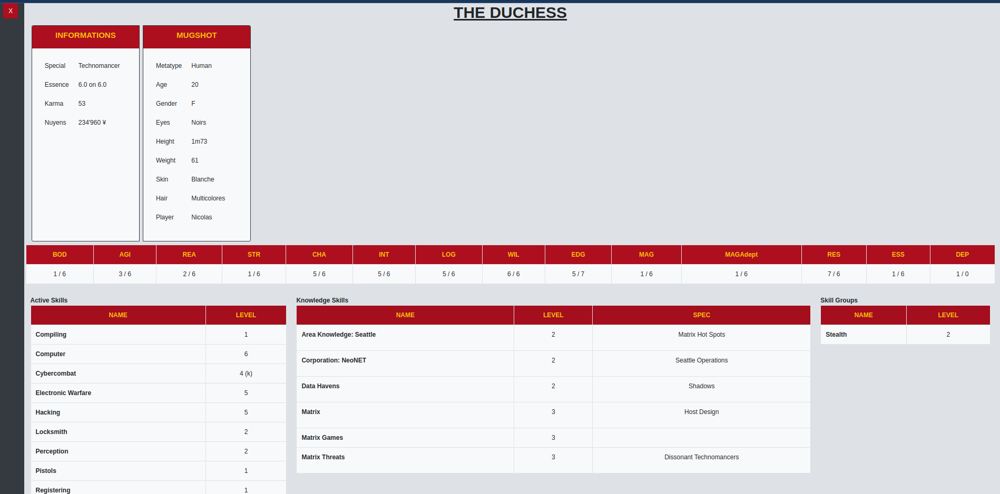

# [Chummer5a](https://github.com/chummer5a/chummer5a) File Online Viewer

## Overview
This webpage let you upload a chum5 file which is a xml file with a fancy name. It converts the file to xml and display some basic informations about the character.
So you don't have to open Chummer5a just to look at the core stats of your character.
When you close the viewer with the "CLOSE CHARACTER" button, you go back to the homepage, and it deletes the xml file from the server.

## Installation
To use it locally, you'll need a php 8.1 server running and Composer to get the Twig dependencies.

To use it online, you'll need a php 8.1 server, Composer and to create a redirection (for example, with Apache2 or nginx).